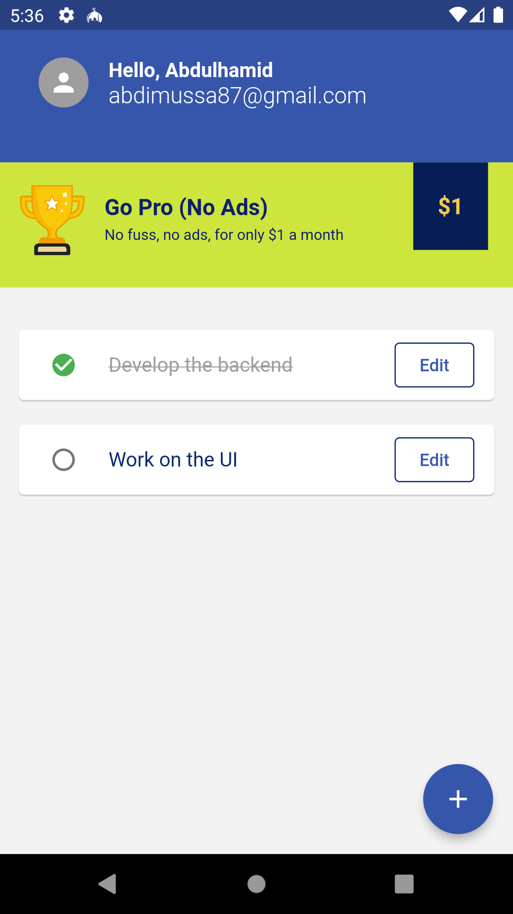
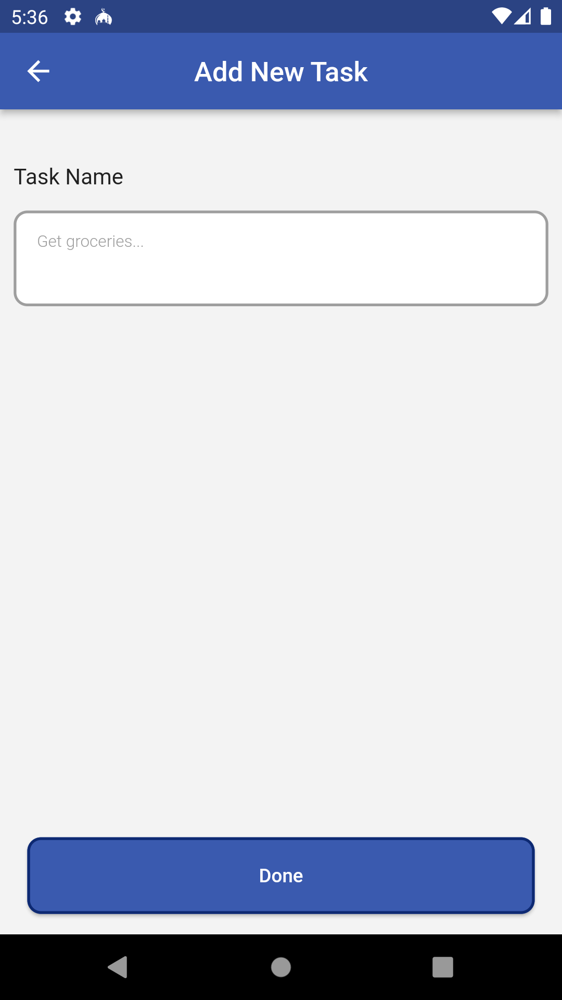
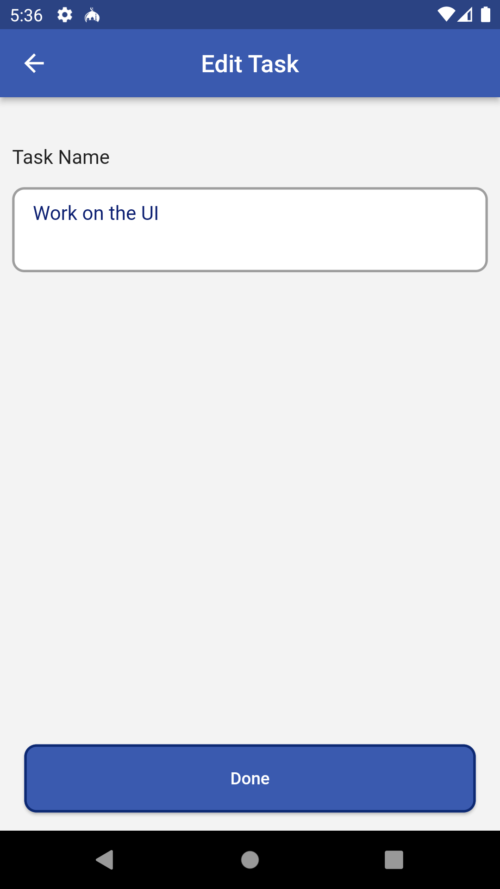

# todo_list

## Overview

A todo list flutter project utilizing SQFlite for the database, Flutter Bloc for state management and Go Router for navigation.

## Preview

## Installation

Make sure you have Flutter sdk installed. Then run the following commands:

<pre>
> git clone https://github.com/abdimussa87/todo-list-flutter
> cd todo-list-flutter
> flutter pub get
> flutter run
</pre>
